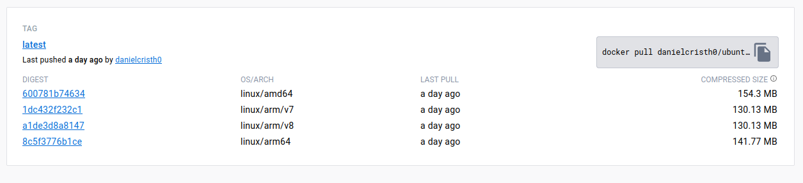

## Case

I have several problems, when I create a Docker image on Ubuntu which in fact uses `amd64` architecture then, when I share the image with my friends, sometimes they have problems. Because the architecture they use is `arm64`.

## Goal

So in this article, I will make a short step on how to create multi-arch Docker image using Docker plugin: [buildx](https://docs.docker.com/engine/reference/commandline/buildx/).

<!--truncate-->

## What is Buildx

Before we start, what is buildx? Buildx is an open-source Docker CLI plugin that brings enhanced build capabilities based Moby BuildKit to the Docker CLI. It’s worth mentioning that the x in buildx stands for experimental, meaning that features and capabilities provided by buildx are not yet stable. Keep in mind that actual features and command line interface may change. Once a feature provided by buildx has matured and become stable, it will be integrated into regular Docker CLI commands such as docker build and others.

## Let's start

First, make sure Docker is installed, then create a new builder called `multi-arch` using buildx command.

```bash
docker buildx create --use --name multi-arch
```

output:

```bash
[+] Building 4.7s (1/1) FINISHED
 => [internal] booting buildkit                                                                                                                                                           4.7s
 => => pulling image moby/buildkit:buildx-stable-1                                                                                                                                        3.7s
 => => creating container buildx_buildkit_multi-arch0                                                                                                                                     1.0s
multi-arch
```

Inspect costum buildx

```bash
Name:          multi-arch
Driver:        docker-container
Last Activity: 2023-09-25 18:58:30 +0000 UTC

Nodes:
Name:      multi-arch0
Endpoint:  unix:///var/run/docker.sock
Status:    running
Buildkit:  v0.12.2
Platforms: linux/amd64, linux/amd64/v2, linux/amd64/v3, linux/386
...

```

After create new builder then,  create a `Dockerfile`, in this case i will create a `Dockerfile` using Ubuntu base image.

```bash
FROM ubuntu:18.04

LABEL maintainer="@danielcristho"

VOLUME /root

# Install packages
RUN DEBIAN_FRONTEND=noninteractive \
    apt-get update \
    && apt-get install -y net-tools build-essential tcpdump telnet traceroute curl iperf3 knot-host openssh-server mtr-tiny socat nmap iputils-ping rsyslog vim iptables iproute2 nano  \
    && rm -rf /var/lib/apt/lists/*

### Clear cache and change shell ###
RUN apt-get clean && \
    apt-get autoclean && \
    apt-get autoremove -y && \
    rm -rf /var/lib/cache/* && \
    rm -rf /var/lib/log/*

CMD ["bash"]
```

Finally after create the `Dockerfile`, let's build into multi-arch using `buildx`.

```docker
docker buildx build --platform linux/amd64,linux/arm64,linux/arm/v7,linux/arm/v8 .
```

By running the command above, we can build Docker image on multi architecture, like `amd64` and `arm64`.

But you can push the image to [DockerHub](https://hub.docker.com) after build by using push arguments. In this case i will push the image to my repository on DockerHub.

```bash
docker buildx build --platform linux/amd64,linux/arm64,linux/arm/v7,linux/arm/v8,linux/arm64/v8 -t danielcristh0/ubuntu-bionic --push .
```

Verify the result in Docker Hub.


### Reference:
- https://github.com/docker/buildx
- https://www.thorsten-hans.com/how-to-build-multi-arch-docker-images-with-ease
